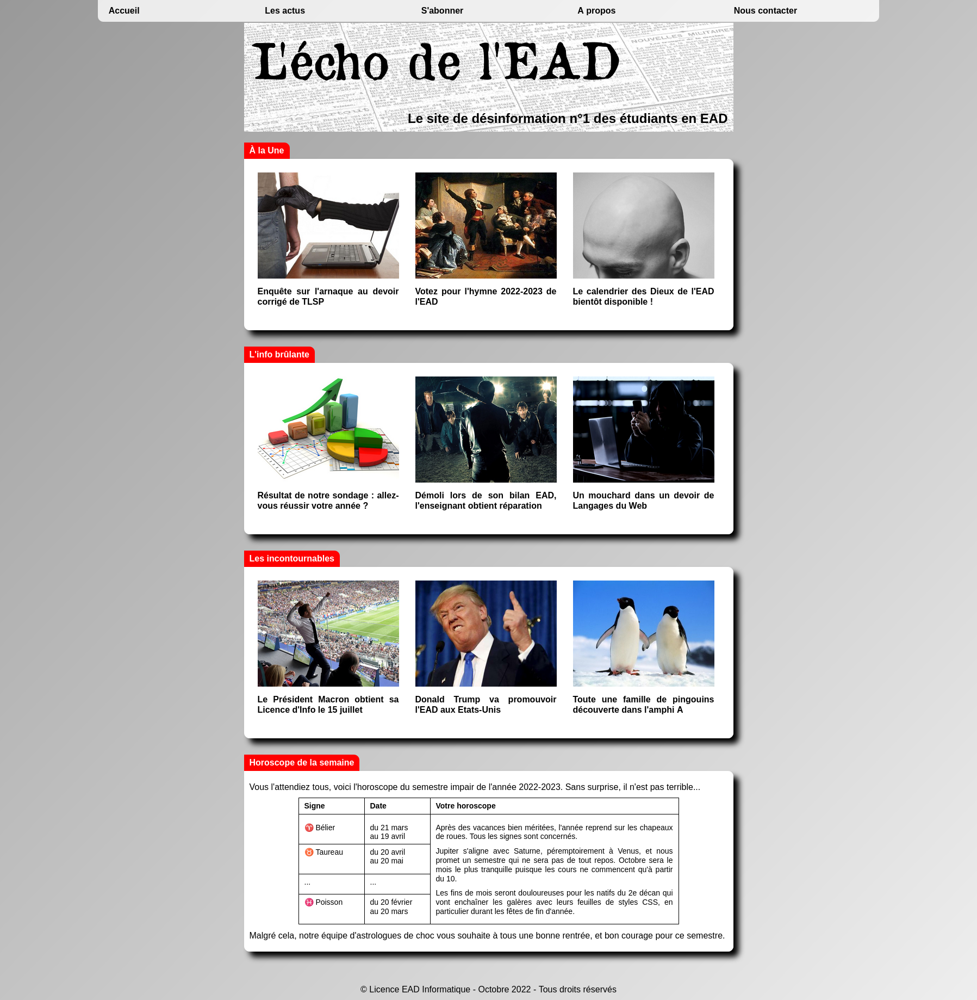
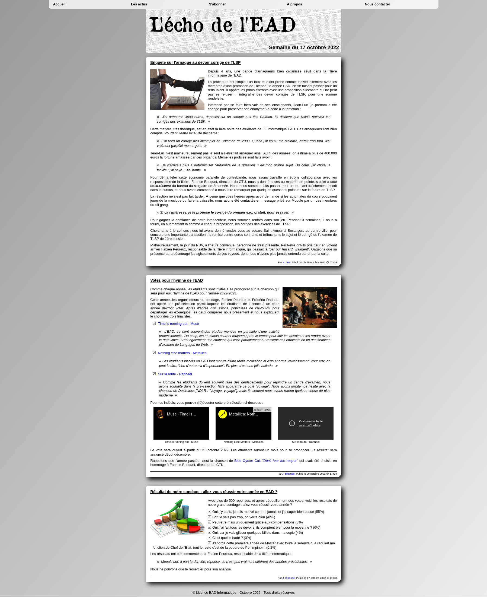
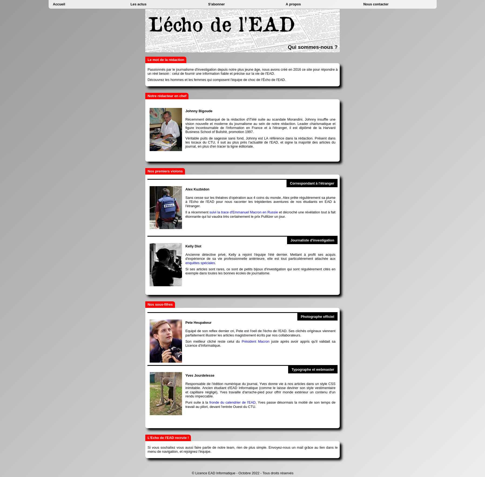
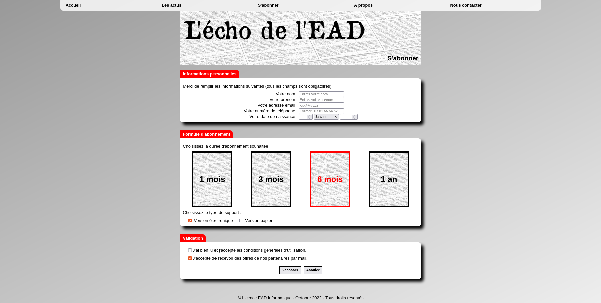

# Fac Parody

**Fac Parody** is a fictitious parody website inspired by university news. This project was created for training purposes in HTML and CSS, with no journalistic intent.

## Screenshots

### Home Page
[](images/HomePage.png)
*Homepage displaying the latest fictitious "news" about university life.*

### Actuality Page
[](images/ActualityPage.png)
*Page detailing parody news with humorous articles.*

### About Page
[](images/AboutPage.png)
*Page presenting the fictitious editors and photographers of the site, with a humorous touch.*

### Subscription Page
[](images/SubscriptionPage.png)
*Page where users can "subscribe" to the fictitious newsletter.*

## Features

- Display of fictitious "news" about university life
- Design inspired by news websites
- Project built using only HTML and CSS

## Technologies Used

- HTML5
- CSS3

## Installation

1. Clone this repository:

```bash
git clone https://github.com/Zynokou/Web-Playground.git
```

2. Navigate to the project folder:

```bash
cd Web-Playground/fac-parody
```

3. Open the index.html file in your preferred browser.

## Disclaimer

This website is a humorous parody. Any resemblance to real events is purely coincidental. Do not take it seriously.

## License

This project is open source and available under the MIT License.